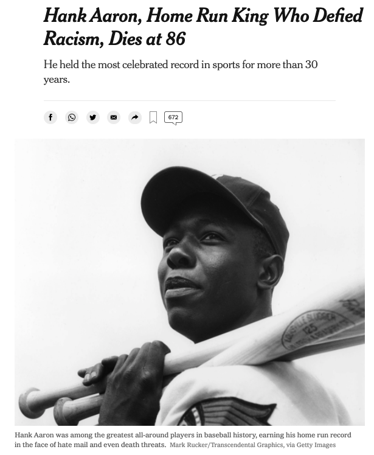

```{r setup, include=FALSE}
knitr::opts_chunk$set(echo = TRUE,
                      message = FALSE,
                      warning = FALSE)
```

## Review

What is a *fixed effect*?

\vspace{1in}

What is a *random effect*?

\vspace{1in}

In general, when would you use each?

\newpage

## Career Trajectories

What is a career trajectory?

\vspace{1in}

Why are people interested in them?

\vspace{1in}

We'll start by looking at OPS (on base percentage plus slugging).  Here are the relevant equations:

On base percentage:

$OBP = \frac{H + BB + HBP}{AB + BB + HBP + SF}$

(Note: Sacrifice flies (SF) were not recorded until the 1950s.)

Slugging percentage:

$SLG = \frac{(H - X2B - X3B - HR) + 2 \times X2B + 3 \times X3B + 4 \times HR}{AB}$

On base percentage plus slugging:

$OPS = OBP + SLG$

Why do baseball analysts like OPS?

\vspace{1.5in}

A convenient model for OPS as a function of age is a quadratic function:

$OPS = A + B(Age - 30) + C(Age - 30)^2$

Why use a model (instead of just the data)?

\vspace{1in}

\newpage

What are some good reasons to use this quadratic model?

\vspace{1in}

What are some bad reasons to use the quadratic model?

\vspace{1in}

Why do we subtract 30 from $Age$ in the model?

\vspace{1in}

Based on this model, find an expression for the peak age (where OPS is the highest). 

\vspace{1.5in}

Based on this model, find an expression for the peak OPS.

\vspace{1.5in}

In the quadratic model, explain what $A$ tells us about a player's trajectory.

\vspace{1in}

In the quadratic model, explain what $C$ tells us about a player's trajectory.

\vspace{1in}

\newpage

## Henry Aaron

{width="50%"}


Let's fit Henry Aaron's trajectory.  The `get_stats()` function from the text (Section 8.2) is helpful.  

```{r}
library(tidyverse)
library(Lahman)
library(knitr)

# Find his playerID in the People table.
aaronID <- People |> 
  filter(nameLast == "Aaron",
         nameFirst == "Hank") |> 
  pull(playerID)

# Function to calculate age and OPS.
get_stats <- function(player){
  Batting |> 
    filter(playerID == player) |> 
    inner_join(People, by = "playerID") |> 
    mutate(birthyear = ifelse(birthMonth >= 7,
                              birthYear + 1, birthYear),
           Age = yearID - birthyear,
           SLG = (H - X2B - X3B - HR + 
                    2 * X2B + 3 * X3B + 4 * HR) / AB,
           OBP = (H + BB + HBP) / (AB + BB + HBP + SF),
           OPS = SLG + OBP) |> 
    select(playerID, Age, SLG, OBP, OPS)
}
```

\newpage

```{r}
# Get Aaron's stats.
aaron <- get_stats(aaronID)

aaron |> 
  kable(digits = 3, caption = "Henry Aaron's statistics by age.")
```

\newpage

```{r, fig.height=3}
aaron |> 
  ggplot(aes(x = Age,
             y = OPS)) +
  geom_point() +
  geom_smooth(method = "lm",
              se = FALSE,
              formula = y ~ poly(x, 2 , raw = TRUE)) +
  labs(title = "Henry Aaron Statistics by Age")
```

\newpage

## Fitting the Quadratic Model

```{r}
fit <- lm(OPS ~ I(Age - 30) + I((Age - 30)^2), data = aaron)

A <- coef(fit)[1]
B <- coef(fit)[2]
C <- coef(fit)[3]

tibble(age.max = 30 - B / C / 2, 
       max = A - B^2 / C / 4) |> 
  kable(digits = 3)
```

There are a lot of things that can go wrong with this.  What do you think about the fit in this instance?


