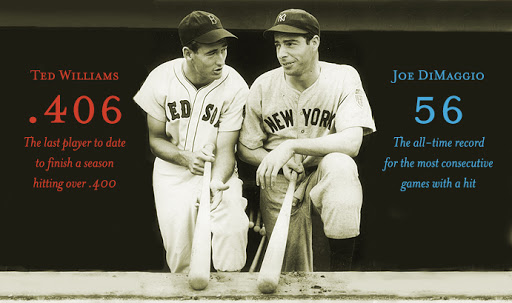

```{r setup, include=FALSE}
knitr::opts_chunk$set(echo = TRUE,
                      message = FALSE,
                      warning = FALSE)
```


## Review

Bayesian Multilevel Modeling

1. How does it improve upon the individual player trajectories?

\vspace{1.5in}

2. What other applications can you think of for it?

\vspace{1.5in}

## DiMaggio's Streak

In 1941, Joe DiMaggio of the New York Yankees got at least one hit in 56 straight games. The streak began on May 15th, 1941 when DiMaggio went 1-for-4 against the Chicago White Sox and ended on July 17th when he went 0-for-3 with a walk against the Cleveland Indians.  

{width=3in}

The following example comes from Chapter 10 of *Analyzing Baseball Data with R* by Marchi, Albert, and Baumer.

\newpage

```{r}
library(tidyverse)
library(knitr)
library(baseballr)

# Load the game-by-game records for DiMaggio's 1941 season.
retro1941 <- retrosheet_data(years_to_acquire = '1941') |> 
  pluck('1941') |> 
  pluck('events')

joe <- 
  retro1941 |> 
  filter(bat_id=='dimaj101', bat_event_fl) |> 
  summarize(H= sum(h_fl>0), PA = n(),AB = sum(ab_fl),.by = 'game_id') |> 
  mutate(Opp = str_sub(game_id,1,3),
         Date = ymd(str_sub(game_id,4,11)),
         Game_tag = str_sub(game_id,-1)) |> 
  arrange(Date)
  
joe |> 
  select(Date, Opp, PA, H) |> 
  head(10)

```

Let's add a variable indicating whether or not he got a hit in the game.

```{r}
joe |> 
  mutate(HIT = ifelse(H > 0, 1,0),
         Rk = row_number()) -> joe

joe |> 
  count(HIT) |> 
  kable(caption = "Number of games by whether DiMaggio got at least one hit (1) or not (0).")
```

Now we wish to calculate the lengths of any hit streaks.

```{r}
# Create a function to calculate streaks.
streaks <- function(y){
  x <- rle(y)
  class(x) <- "list"
  return(as_tibble(x))
}

joe |> 
  pull(HIT) |> 
  streaks() |> 
  filter(values == 1) |> # focus only on hit streaks
  pull(lengths)

```

## Moving Average

How did Joe DiMaggio's batting average vary over the course of the season?  Let's look at a 10-game moving (or rolling) average.

```{r}
library(zoo)
moving_average <- function(df, width){
  N <- nrow(df)
  df |> 
    transmute(Game = rollmean(1:N, k = width, fill = NA),
              Average = rollsum(H, width, fill = NA) / rollsum(AB, width, fill = NA))
}

joe_ma <- moving_average(joe, 50)

joe_ma |> 
  ggplot(aes(x = Game, y = Average)) +
  geom_line() +
  geom_hline(data = summarize(joe, bavg = sum(H) / sum(AB)),
             aes(yintercept = bavg)) +
  geom_rug(data = filter(joe, HIT == 1),
           aes(Rk, .3 * HIT), sides = "b")
```

## How unusual was DiMaggio's streak for a player who hit safely in 114 of 139 games?

* Let's review Father Costa's approach.

[MLB Video: Costa 56 Probability](https://www.mlb.com/yankees/video/56-probability-c702744983)

```{r}
joe |> 
  filter(between(Date,ymd('19410515'),ymd('19410716'))) |> 
  summarize(PA=sum(PA),
            AB=sum(AB),
            H=sum(H),
            BA = H/AB,
            Games = n(), 
            AB_per_game = AB/Games,
            prob_H_in_game = 1-(1-BA)^AB_per_game,
            prob_56_straight_H = prob_H_in_game^Games)
  

```

* Here's another approach using simulation.

For a player who hit safely in 114 of 139 games, let's see how unusual it would be for him to have a streak of 56 or more consecutive games using simulation. The follow code shuffles the *HIT* column and returns the longest streak for each of *r* simulated seasons.

```{r, cache = TRUE}
# This function shuffles the y vector and returns the longest streak.
random_mix <- function(y){
  y |> 
    sample() |> 
    streaks() |> 
    filter(values == 1) |> 
    arrange(-lengths) |> 
    head(1) |> 
    pull(lengths)
}

# Set the number of replications for the simulation.
r = 1000 

# Run a simulation experiment.
# You can think of replication as a for loop.
set.seed(388)
joe_random <- replicate(r, random_mix(joe$HIT))

sim_result <- tibble(streak_long = joe_random)
sim_result |> 
  ggplot(aes(x = streak_long)) + 
  geom_histogram() +
  theme_bw() +
  labs(title = str_c("Longest streak from each random season (r = ",r,")"),
       x = "Longest Streak") +
  geom_vline(xintercept = 56)

sum(joe_random >= 56) / r
```

How do we interpret the graph above?

\vspace{1in}

How should we interpret the probability we've just calculated?

\vspace{1in}

## Streakiness Statistic

How would you quantify a player's streakiness?  Does your favorite player get hot or go cold more than would be expected by random variation alone?  Let's come up with some ideas before we discuss it further next time.


