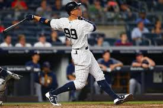
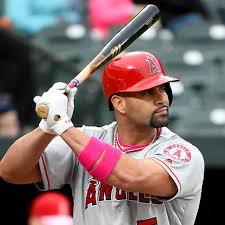

```{r setup, include= FALSE}
knitr::opts_chunk$set(echo = TRUE, fig.height = 3, message= FALSE, warning = FALSE)
```

## Review

Let's look at J.D. Martinez and Aaron Judge.

{height=200px} \hspace{.5in} {height=200px}

Here are their career statistics.

```{r}
library(Lahman)
library(tidyverse)
library(knitr)

source('Chapter8_functions.R')

People |> 
  filter(nameLast == "Judge", nameFirst == "Aaron") |> 
  pull(playerID) -> judge_id
People |> 
  filter(nameLast == "Martinez", nameFirst == "J. D.") |> 
  pull(playerID) -> jd_id

player_ids <- c(judge_id, jd_id)

Batting |> 
  filter(playerID %in% player_ids) |> 
  filter(yearID<2023) |> 
  group_by(playerID) |> 
  summarise(HR = sum(HR),
            BB = sum(BB),
            AB = sum(AB),
            HBP = sum(HBP),
            SF = sum(SF)) |> 
  mutate(PA = AB + BB + HBP + SF) |> 
  left_join(People |> select(nameLast, nameFirst, playerID)) |> 
  mutate(name = paste(nameFirst, nameLast, sep = " ")) |> 
  select(everything(), -nameLast, -nameFirst, -HBP, -SF) -> career_totals

career_totals |>
  kable(caption = "Career Statistics (through 2022 season)")
```

```{r, echo = FALSE, message = FALSE, warning= FALSE, fig.height=2}
player_ids |>
  map_df(get_stats) |> 
  left_join(People |> select(nameLast, nameFirst, playerID)) |> 
  mutate(name = paste(nameFirst, nameLast, sep = " ")) -> player_stats

player_stats |> 
  ggplot(aes(x = Age, y = HR, shape = name, color = name)) +
  geom_point() + 
  theme_classic()
```

If Aaron Judge had the same number of plate appearances ($newPA = 5886$) as J.D. Martinez, how many career home runs would Aaron Judge have with $kicker = 1.05$?

```{r}
newPA = 5886
career_totals |> 
  filter(playerID == "judgeaa01") |> 
  mutate(x = (AB/(AB + BB))*newPA - AB,
         EC = 1 + x/AB*1.05,
         AB.proj = round(x + AB),
         HR.proj = round(EC * HR)) |> 
  kable()
```

# OPS

A common statistic reported for batters is On Base Percentage Plus Slugging (OPS).  

On Base Percentage Plus Slugging = On Base Percentage (OBP) + Slugging Percentage (SLG).

On Base Percentage = $OBP = \frac{H + BB + HBP}{AB + BB + HBP + SF}$.

Slugging Percentage = $SLG = \frac{TB}{AB} = \frac{1B + 2*2B + 3*3B + 4*HR}{AB}$

## Carl Yastrzemski


Carl Yastrzemski ("Yaz") played his entire 23-year career (1961-1983) with the Boston Red Sox.  Using the *similar* function of Chapter 8, here are six players with similar career statistics as Yaz.

```{r, message = FALSE, warning = FALSE, fig.height=3}
plot_trajectories("Carl Yastrzemski", n.similar = 6)
```

## Albert Pujols

{width=200px}

Albert Pujols played 22 seasons (2001 - 2022) with the St. Louis Cardinals and Los Angeles Angels.

## Yaz vs. Pujols

Their career numbers are pretty similar.

```{r}
player_ids <- c("yastrca01", "pujolal01")
Batting |> 
  filter(playerID %in% player_ids) |> 
  group_by(playerID) |> 
  summarize(H = sum(H),
            AB = sum(AB),
            HR = sum(HR),
            SLG = (sum(H) - sum(X2B) - sum(X3B) - sum(HR) +
             2 * sum(X2B) + 3 * sum(X3B) + 4 * sum(HR))/sum(AB),
           OBP = (sum(H) + sum(BB) + sum(HBP))/(sum(AB) + sum(BB)+ sum(HBP) + 
                                                  sum(SF))) |> 
  mutate(OPS = SLG + OBP,
         AVG = H / AB) |> 
  left_join(People |> select(nameLast, nameFirst, playerID)) |> 
  mutate(name = paste(nameFirst, nameLast, sep = " ")) |> 
  select(name, everything(), -nameLast, -nameFirst) -> player_careers

player_careers |> 
  kable(caption = "Career Totals", digits = 3)
```

Why isn't it fair to directly compare Yaz and Pujols?

```{r, echo = FALSE, fig.height = 2}
Batting |> 
  filter(yearID > 1953) |> 
  group_by(yearID, lgID) |> 
  summarize(SLG_lg = (sum(H) - sum(X2B) - sum(X3B) - sum(HR) +
             2 * sum(X2B) + 3 * sum(X3B) + 4 * sum(HR))/sum(AB),
           OBP_lg = (sum(H) + sum(BB) + sum(HBP))/(sum(AB) + sum(BB)+ sum(HBP) 
                                                   + sum(SF))) |> 
mutate(OPS_lg = SLG_lg + OBP_lg) -> lg_stats
           
lg_stats |> 
  ggplot(aes(x = yearID, y = OPS_lg, color = lgID)) +
  geom_line() +
  theme_bw() +
  theme_classic() + 
  labs(x = "Year", y = "League OPS")
```

# OPS+

Instead, we could use a statistic that adjusts for the overall offense in the league.  OPS+ is such a statistic.

$$OPS+ = 100 \times \left(\left(\frac{OBP_{\text{player}}}{OBP_{\text{league}}}\right) + \left(\frac{SLG_{\text{player}}}{SLG_{\text{league}}}\right) - 1\right)$$

Let's compare the OPS+ of Yaz and Pujols.

```{r, fig.height = 2}
# Calculate OPS
Batting |> 
  filter(playerID %in% player_ids) |> 
  mutate(SLG = (H - X2B - X3B - HR +
             2 * X2B + 3*X3B + 4 * HR)/AB,
           OBP = (H + BB + HBP)/(AB + BB+ HBP + SF),
           OPS = SLG + OBP,
           AVG = H/AB) |> 
  left_join(People |> select(nameLast, nameFirst, playerID)) |> 
  mutate(name = paste(nameFirst, nameLast, sep = " ")) -> yearly_stats

# Join with league stats
yearly_stats |> 
  select(name, AB, H, HR, AVG, OPS) |> 
  head(5) |> 
  kable(digits = 3)

lg_stats |> 
  head(5) |> 
  kable()

yearly_stats |> 
  left_join(lg_stats, by = c("yearID","lgID")) -> yearly_stats

# Calculate OPS+
yearly_stats |> 
  mutate(OPS_plus = 100 * ((OBP/OBP_lg + SLG/SLG_lg) - 1)) -> yearly_stats

library(gridExtra)
p1 = yearly_stats |> 
  ggplot(aes(x = yearID, y = OPS_plus, color = name)) +
  geom_line() + 
  theme_classic() +
  labs(y = "OPS+", title = "OPS+ of Pujols and Yaz") + 
  theme(legend.position = "bottom")

p2 = yearly_stats |> 
  ggplot(aes(x = yearID, y = OPS, color = name)) +
  geom_line() + 
  theme_classic() +
  labs("OPS", title = "OPS of Pujols and Yaz") +
  theme(legend.position = "bottom")

grid.arrange(p1, p2, ncol = 2)
```

What are some limitations of OPS+?

\vspace{1.in}

# Isolated Power

Isolated Power (ISO) is a statistic that communicates a hitter's extra bases per at-bat.  Batters can provide similar offensive value with very different ISO, meaning ISO helps us understand what kind of hitter a player is more than as a standalone measure of value.  

$$ISO = \frac{2B + 2\times 3B + 3\times HR}{AB} = SLG - AVG = \frac{\text{Extra Bases}}{\text{At-Bats}}$$

ISO is useful because two players with identical batting averages can be having very different seasons, and two players with the same slugging percentages can be having very different seasons -- even if you hold walks, plate appearances, park effects, and luck constant.

Lets take a look at ISO for Albert Pujols and Yaz.

```{r}
yearly_stats |> 
  mutate(ISO = X2B + 2 * X3B + 3 * HR) |> 
  ggplot(aes(x = yearID, y = ISO, color = name)) +
  geom_line() + 
  theme_classic() +
  labs(title = "ISO of Pujols and Yaz")+
  theme(legend.position = "bottom")
```
# BABIP (Batting Average on Balls in Play)

*Why might this be an interesting metric?*

*What is an advantage of this metric over most others? (Hint: what players does it count for?)*

### BABIP Formula

$$
BABIP = \frac{H - HR}{AB - SO - HR + SF}
$$

## Daniel Murphy Offensive Statistics (Through 2016)

The table below shows Daniel Murphy’s offensive statistics for selected seasons. Note that Murphy did not play in 2010.

| Year | AB  | H   | HR | SF | SO |
|------|-----|-----|----|----|----|
| 2008 | 131 | 41  | 2  | 1  | 28 |
| 2009 | 508 | 135 | 12 | 6  | 69 |
| 2011 | 391 | 125 | 6  | 2  | 42 |
| 2012 | 571 | 166 | 6  | 4  | 82 |
| 2013 | 658 | 188 | 13 | 5  | 95 |
| 2014 | 596 | 172 | 9  | 5  | 86 |
| 2015 | 499 | 140 | 14 | 6  | 38 |
| 2016 | 531 | 184 | 25 | 8  | 57 |

---

## Calculate Murphy’s BABIP in 2009

*What does that communicate to us? Who do we compare it to?*

```{r, include=FALSE}
BABIP = (135-12)/(508-69-12+6)
BABIP

```

